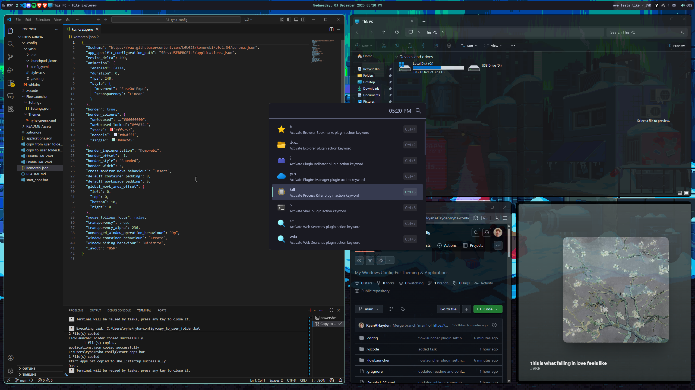
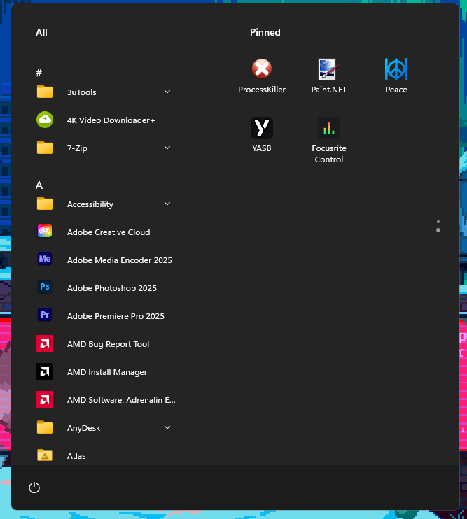
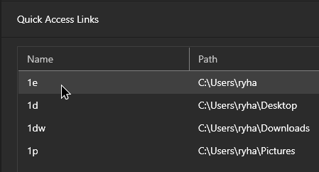

# ryha-config
This is My Windows Config For Theming &amp; Applications. <br>
Mostly for personal reasons but feel free to mess around with the configs.
<br>
<br>

<br>

# < [EarTrumpet](https://eartrumpet.app/) >
```
winget install File-New-Project.EarTrumpet
```
### Settings
Open Taskbar flyout: `Ctrl+Shift+Alt+S`

# < [Nerd Font](https://github.com/ryanoasis/nerd-fonts/releases/latest/download/JetBrainsMono.zip) > (Required)

# < [YASB](https://docs.yasb.dev/latest/installation) >
```
winget install --id DEVCOM.JetBrainsMonoNerdFont
```

# < [WindHawk](https://windhawk.net/) >
```
winget install windhawk
```
### Mods
- `explorer-details-better-file-sizes`
- `chrome-wheel-scroll-tabs` (reverse)
- `taskbar-on-top`
- `windows-11-start-menu-styler` (SideBySideMinimal)
  



# < [Flow Launcher](https://github.com/Flow-Launcher/Flow.Launcher) >
```
winget install "Flow Launcher"
```
### Settings & Theme
Copy `/FlowLauncher` to
`C:\Users\{user}\AppData\Roaming`
Apply `ryha-green` using `fltheme ryha-green`

### Plugins
- Steam Search by Garulf
- Visual Studio Code Workspaces by ricardosantos9521, MaskedRPGFan

### Plugin Settings
Set explorer shortcuts like these:



# < [Nilesoft](https://nilesoft.org/download) >
```
winget install nilesoft.shell
```
# < [THide](https://github.com/amnweb/thide?tab=readme-ov-file) > (Taskbar Hide)

# Unused
## < [masir](https://github.com/LGUG2Z/masir) > (Auto Focus Window Cursor is over)
```
winget install LGUG2Z.masir
```