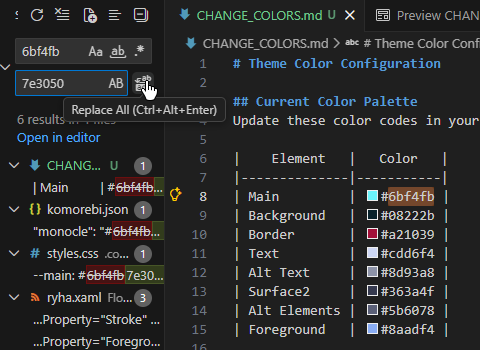

# ryha-config
This is My Windows Config For Theming &amp; Applications. <br>
Mostly for personal reasons but feel free to mess around with the configs.
<br>
<br>

<br>

## Replace the theme colors with your own:
1. In CHANGE_COLORS.md Select each color code
2. Replace all instances in your theme files
3. Run task copy to user folder
4. Apply the theme to Flow Launcher using:
   ```
   fltheme ryha
   ```

# Install

## < [Nerd Font](https://github.com/ryanoasis/nerd-fonts/releases/latest/download/JetBrainsMono.zip) > (Required for icons)

## < [Komorebi](https://github.com/LGUG2Z/komorebi) >
```
winget install -e --id LGUG2Z.komorebi
```
## < [YASB](https://docs.yasb.dev/latest/installation) >
```
winget install --id DEVCOM.JetBrainsMonoNerdFont
```

## < [WindHawk](https://windhawk.net/) >
```
winget install windhawk
```
### Mods
- `explorer-details-better-file-sizes`
- `taskbar-on-top`
- `windows-11-start-menu-styler` (SideBySideMinimal)
  


## < [Flow Launcher](https://github.com/Flow-Launcher/Flow.Launcher) >
```
winget install "Flow Launcher"
```
### Settings & Theme
Copy `/FlowLauncher` to
`C:\Users\{user}\AppData\Roaming`
Apply `ryha-green` using `fltheme ryha-green`

### Plugins
- Steam Search `by Garulf`
- Visual Studio Code Workspaces `by ricardosantos9521, MaskedRPGFan`
- FlowYoutube `by Garulf`

### Plugin Settings
Set explorer shortcuts like these:


## < [THide](https://github.com/amnweb/thide?tab=readme-ov-file) > (Taskbar Hide)

# Recommended
## < [Zen Browser](https://zen-browser.app/) >
### [Sine](https://github.com/CosmoCreeper/Sine)
- `Advanced Tab Groups (BETA) (v3.2.1b)`
### Settings
- Sidebar and Top Toolbar
- Toggle Compact Mode: `Ctrl + Shift + S`
## < [EarTrumpet](https://eartrumpet.app/) >
```
winget install File-New-Project.EarTrumpet
```

### Settings
Open Taskbar flyout: `Ctrl+Shift+Alt+S`

## < [TwinkleTray](https://twinkletray.com/) >
```
winget install xanderfrangos.twinkletray
```
