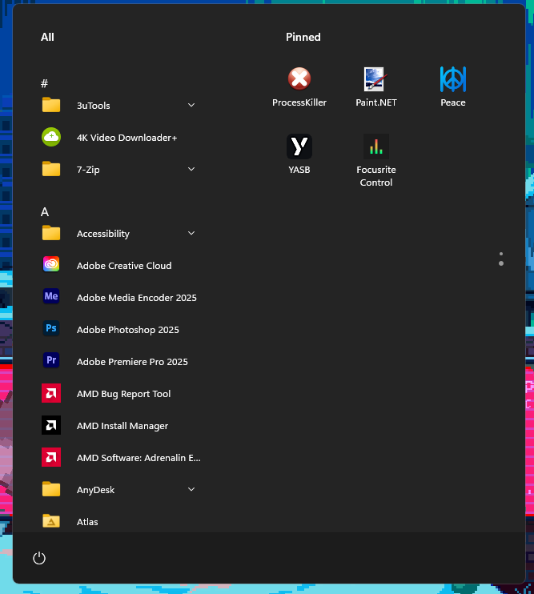
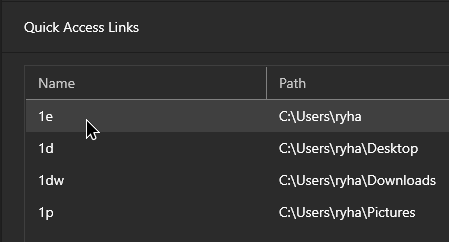

# ryha-config
This is My Windows Config For Tiling. <br>
Mostly for personal reasons but feel free to mess around with the configs.

!! GlazeWM Zebar themes are not changed by `CHANGE_COLORS.md` yet.

Install what you want manually or use the included `installs.bat`

# Install

## < [Nerd Font](https://github.com/ryanoasis/nerd-fonts/releases/latest/download/JetBrainsMono.zip) > (Required for icons)
```
winget install --id DEVCOM.JetBrainsMonoNerdFont
```
## < [GlazeWM](https://github.com/glzr-io/glazewm) >
```
winget install -e --id glzr-io.glazewm
```

## < [AltSnap](https://github.com/RamonUnch/AltSnap) >
```
winget install AltSnap.AltSnap
```

### Config:
Use included AltSnap.ini (Copied in `copy_to_user_folder.bat`)

## < [WindHawk](https://windhawk.net/) >
```
winget install windhawk
```

### Mods
listed in /Windhawk/userprofile.json
- `windows-11-start-menu-styler` (SideBySideMinimal)
- `taskbar-icon-size` - Height: `28` - Icon: `20` - Width: `28`
- `windows-11-taskbar-styler` - SimplyTransparent
  


## < [Flow Launcher](https://github.com/Flow-Launcher/Flow.Launcher) >
```
winget install "Flow Launcher"
```
### Settings & Theme
Copy `/FlowLauncher` to
`C:\Users\{user}\AppData\Roaming`
Apply `ryha` using `fltheme ryha`

### Plugins
- Steam Search `by Garulf`
- Visual Studio Code Workspaces `by ricardosantos9521, MaskedRPGFan`
- FlowYoutube `by Garulf`

### Plugin Settings
Set explorer shortcuts like these:



# Recommended
## < [Zen Browser](https://zen-browser.app/) >
### Settings
- Compact Hides Sidebar and Top Toolbar

## < [TwinkleTray](https://twinkletray.com/) >
```
winget install xanderfrangos.twinkletray
```

---